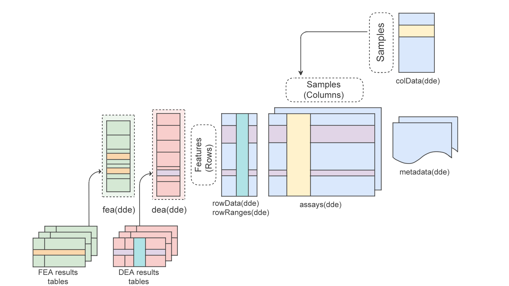

```{r setup, include = FALSE}
knitr::opts_chunk$set(
  collapse = TRUE,
  comment = "#>",
  error    = FALSE,
  warning  = FALSE,
  eval     = TRUE,
  message  = FALSE
)
```

# Introduction {#introduction}

## Why do we need a new class?

Differential expression analysis (DEA) and functional enrichment analysis (FEA) are core steps in transcriptomic workflows, helping researchers detect and interpret biological differences between conditions. However, as the number of conditions (defined by complex experimental designs) and analysis tools increases, managing the outputs of these analyses across multiple contrasts becomes increasingly overwhelming. This challenge is further amplified in single-cell RNA-seq, where pseudo-bulk analyses generate numerous results tables across cell types and contrasts, making it challenging to organize, explore, and reproduce findings, even for experienced users.

To address these issues, we introduce the `r BiocStyle::Biocpkg("DeeDeeExperiment")` class, an S4 object that extends the widely adopted `SummarizedExperiment` class in Bioconductor.

`DeeDeeExperiment` provides a structured and consistent framework for integrating DEA and FEA results alongside core expression data and metadata. By centralizing these results in a single container, `DeeDeeExperiment` enables users to retrieve, explore, and manage their analysis results more efficiently across multiple contrasts.

This vignette introduces the class structure, demonstrates how to create and work with `DeeDeeExperiment` objects, and walks through a typical RNA-seq workflow using the class.

## Anatomy of DeeDeeExperiment

The `DeeDeeExperiment` class inherits from the core Bioconductor `SummarizedExperiment` object. This means it inherits all the slots, methods, and compatibility with tools built for `SummarizedExperiment`, while introducing additional components to streamline downstream analysis.



Specifically, `DeeDeeExperiment` has two new slots:

- `dea` : a list that stores results from differential expression analysis (DEA), along with relevant metadata. This includes:

  - The used FDR and LFC thresholds.
  
  - Meta info related to both the LFC and p value.
  
  - The package used to generate the DE results (e.g. `DESeq2`, `edgeR`, `limma`).
  
  - A copy of the original result object.
  
The main columns to use in DEA (`log2FoldChange`, `pvalue`, and `padj`) are also stored in the `rowData` of the `DeeDeeExperiment` object.

- `fea` : a list that stores results from functional enrichment analysis (FEA), along with relevant metadata. This includes:
  
  - The name of the associated DEA contrast.
  
  - The FEA name.
  
  - A `GeneTonicList` (ready to be used in `r BiocStyle::Biocpkg("GeneTonic")`).
  
  - The enrichment tool used to generate the results (e.g. `topGO`, `ClusterProfiler...`).
  
  - A copy of the original result object.

## Creating a `DeeDeeExperiment` object

In order to create a `DeeDeeExperiment` object, at least one of the following inputs are required:

- `se`: A `SummarizedExperiment` object, that will be used as a scaffold to store the DE related information.

- `de_results`: A named list of DE results, in any of the formats supported by the package (currently results from `DESeq2`, `edgeR`, or `limma`).

- `enrich_results`: A named list of FE results, as `data.frame` generated by one of the following packages (currently `topGO`, `ClusterProfiler` ... TODO to be updated)

```{r create_dde, eval=FALSE}
# do not run
dde <- DeeDeeExperiment(se =se, # se is a SummarizedExperiment object
                        # de_results is a named list of de results
                        de_results = de_results,
                        # enrich_res is a named list of enrichment results
                        enrich_results = enrich_res)
```

# Getting started {#gettingstarted}

To install this package, start R and enter:

```{r install, eval=FALSE}
if (!requireNamespace("BiocManager", quietly = TRUE))
  install.packages("BiocManager")

BiocManager::install("DeeDeeExperiment")
```

Once installed, the package can be loaded and attached to your current workspace as follows:

```{r loadlib, eval = FALSE}
library("DeeDeeExperiment")
```

# `DeeDeeExperiment` on the `macrophage` dataset

In the remainder of this vignette, we will illustrate the main features of `r BiocStyle::Biocpkg("DeeDeeExperiment")` on a publicly available dataset from Alasoo, et al. "Shared genetic effects on chromatin and gene expression indicate a role for enhancer priming in immune response", published in Nature Genetics, January 2018 [@Alasoo2018]
[doi:10.1038/s41588-018-0046-7](https://doi.org/10.1038/s41588-018-0046-7).

The data is made available via the `r BiocStyle::Biocpkg("macrophage")` Bioconductor package, which contains the files output from the Salmon quantification (version 0.12.0, with Gencode v29 reference), as well as the values summarized at the gene level, which we will use to exemplify.

In the `macrophage` experimental setting, the samples are available from 6 different donors, in 4 different conditions (naive, treated with Interferon gamma, with SL1344, or with a combination of Interferon gamma and SL1344).

Let's start by loading all the necessary packages

```{r loadlibraries}
library("DeeDeeExperiment")

library("macrophage")
library("DESeq2")
library("edgeR")
library("mosdef")
library("GeneTonic")
library("org.Hs.eg.db")
library("topGO")
library("clusterProfiler")
library("ReactomePA")
library("pcaExplorer")
```

We will demonstrate how `DeeDeeExperiment` fits into a regular bulk RNA-seq data analysis workflow. For this we will start by processing the data and setting up the design for the Differential Expression Analysis (DEA).

```{r processing, cache=TRUE}
# load data
data(gse, package = "macrophage")
# set up design
dds_macrophage <- DESeqDataSet(gse, design = ~ line + condition)
rownames(dds_macrophage) <- substr(rownames(dds_macrophage), 1, 15)
keep <- rowSums(counts(dds_macrophage) >= 10) >= 6

dds_macrophage <- dds_macrophage[keep, ]

dds_macrophage

dds_macrophage <- DESeq(dds_macrophage)

dim(dds_macrophage)
head(counts(dds_macrophage))

# BIUMmisc::plot_totcounts(dds_macrophage, "condition")

colData(dds_macrophage)

pcaExplorer::pcaplot(vst(dds_macrophage), intgroup = "condition", ntop = 5000, ellipse = FALSE)
pcaExplorer::pcaplot(vst(dds_macrophage), intgroup = "line", ntop = 5000, ellipse = FALSE)

anno_df <- pcaExplorer::get_annotation_orgdb(dds_macrophage, "org.Hs.eg.db", "ENSEMBL")

# mart <- useMart(biomart="ENSEMBL_MART_ENSEMBL",
#                 dataset="hsapiens_gene_ensembl")
# mart
# anns <- getBM(attributes = c("ensembl_gene_id", "external_gene_name", "description"), 
#               filters = "ensembl_gene_id",
#               # filters = "external_gene_name",
#               values = rownames(dds_macrophage), 
#               mart = mart)
# 
# anns <- anns[match(rownames(dds_macrophage), anns$ensembl_gene_id), ]
# save(anns, file = "biomart_anno_macrophage.RData")
# then will be re-sorted according to the table to attach it to
#load(file = "biomart_anno_macrophage.RData")

anns_path <- system.file("extdata", "biomart_anno_macrophage.RData", package = "DeeDeeExperiment")
load(anns_path)

anns_df <- anns

rownames(anns_df) <- rownames(dds_macrophage)

FDR <- 0.05

## subsetting to make it faster!

set.seed(42)
dds_macrophage <- dds_macrophage[sample(rownames(dds_macrophage), 1000)]

dds_macrophage
```


```{r alltheresustep, cache=TRUE}
# DE with DESeq2
alltheresults <- function(resuSet, 
                          dds_obj, 
                          contrast, 
                          FDR,
                          logFC_threshold,
                          anno_df, 
                          anns, 
                          species) {
  
  id_contrast <- contrast
  resuSet[[id_contrast]] <- list()
  
  mycoef <- contrast
  
  message("Extracting results...")
  resuSet[[id_contrast]][["res_DESeq"]] <- results(dds_obj,
                                                   name = mycoef, 
                                                   lfcThreshold = logFC_threshold,
                                                   alpha = FDR)
  summary(resuSet[[id_contrast]][["res_DESeq"]])
  message("Performing LFC shrinkage...")
  resuSet[[id_contrast]][["res_DESeq"]] <- lfcShrink(dds_obj,coef = mycoef,res = resuSet[[id_contrast]][["res_DESeq"]], type = "apeglm") 
  resuSet[[id_contrast]][["res_DESeq"]]$SYMBOL <- anno_df$gene_name[match(rownames(resuSet[[id_contrast]][["res_DESeq"]]), anno_df$gene_id)]
  
  message("Summary MAplot...")
  # resuSet[[id_contrast]][["maplot_res"]] <- 
    # ideal::plot_ma(resuSet[[id_contrast]][["res_DESeq"]], ylim = c(-4,4), title = id_contrast)
  
  message("Extracting tables...")
  resuSet[[id_contrast]][["tbl_res_all"]] <- mosdef::deresult_to_df(resuSet[[id_contrast]][["res_DESeq"]])
  resuSet[[id_contrast]][["tbl_res_all"]]$geneSymbol <- anno_df$gene_name[match(resuSet[[id_contrast]][["tbl_res_all"]]$id, anno_df$gene_id)]
  resuSet[[id_contrast]][["tbl_res_all"]]$description <- anns$description[match(resuSet[[id_contrast]][["tbl_res_all"]]$id, anns$ensembl_gene_id)]
  
  message("Extracting DEtables...")
  resuSet[[id_contrast]][["tbl_res_DE"]] <- mosdef::deresult_to_df(resuSet[[id_contrast]][["res_DESeq"]],FDR = FDR)
  resuSet[[id_contrast]][["tbl_res_DE"]]$geneSymbol <- anno_df$gene_name[match(resuSet[[id_contrast]][["tbl_res_DE"]]$id, anno_df$gene_id)]
  resuSet[[id_contrast]][["tbl_res_DE"]]$description <- anns$description[match(resuSet[[id_contrast]][["tbl_res_DE"]]$id, anns$ensembl_gene_id)]
  resuSet[[id_contrast]][["tbl_res_DE"]]$chromosome_name <- anns$chromosome_name[match(resuSet[[id_contrast]][["tbl_res_DE"]]$id, anns$ensembl_gene_id)]
  
  if(nrow(resuSet[[id_contrast]][["tbl_res_DE"]]) > 0) {
    message("Generating interactive DEtable...")
    resuSet[[id_contrast]][["etbl_res_DE"]] <- resuSet[[id_contrast]][["tbl_res_DE"]]
    resuSet[[id_contrast]][["etbl_res_DE"]]$id <- mosdef::create_link_ENSEMBL(resuSet[[id_contrast]][["etbl_res_DE"]]$id, species = species)
    resuSet[[id_contrast]][["etbl_res_DE"]]$geneSymbol <- mosdef::create_link_NCBI(resuSet[[id_contrast]][["etbl_res_DE"]]$geneSymbol)
  }
  
  mybuttons <- c('copy', 'csv', 'excel', 'pdf', 'print')
  DT::datatable(resuSet[[id_contrast]][["etbl_res_DE"]],caption = paste0(id_contrast,", DE genes"),escape=FALSE, extensions = 'Buttons', options = list(dom = 'Bfrtip',buttons = mybuttons))
  
  return(resuSet)
}

beautify_GO_table <- function(enrich_tbl, GO_id_column = "GO.ID") {
  rownames(enrich_tbl) <- enrich_tbl[[GO_id_column]]
  enrich_tbl[[GO_id_column]] <- mosdef::create_link_GO(enrich_tbl[[GO_id_column]])
  return(enrich_tbl)
}

create_link_reactome <- function(val) {
  sprintf('<a href="https://reactome.org/content/detail/%s" target="_blank" class="btn btn-primary" style = "%s">%s</a>', 
          val, 
          mosdef:::.actionbutton_biocstyle,
          val)
}

beautify_Reactome_table <- function(enrich_tbl, Reactome_id_column = "ID") {
  rownames(enrich_tbl) <- enrich_tbl[[Reactome_id_column]]
  enrich_tbl[[Reactome_id_column]] <- create_link_reactome(enrich_tbl[[Reactome_id_column]])
  return(enrich_tbl)
}

resultsNames(dds_macrophage)

## Generating the results

myresuset_macs <- list()

myresuset_macs <- alltheresults(
  myresuset_macs, dds_macrophage,
  contrast = c("condition_IFNg_vs_naive"), FDR = FDR, logFC_threshold = 1,
  anno_df = anno_df, anns = anns_df, species = "Homo_sapiens")
names(myresuset_macs)[1] <- "condition_IFNg_vs_naive"

myresuset_macs <- alltheresults(
  myresuset_macs, dds_macrophage,
  contrast = c("condition_IFNg_SL1344_vs_naive"), FDR = FDR, logFC_threshold = 1,
  anno_df = anno_df, anns = anns_df, species = "Homo_sapiens")
names(myresuset_macs)[2] <- "condition_IFNg_SL1344_vs_naive"

myresuset_macs <- alltheresults(
  myresuset_macs, dds_macrophage,
  contrast = c("condition_SL1344_vs_naive"), FDR = FDR, logFC_threshold = 1,
  anno_df = anno_df, anns = anns_df, species = "Homo_sapiens")
names(myresuset_macs)[3] <- "condition_SL1344_vs_naive"

myresuset_macs$condition_IFNg_vs_naive$maplot_res

DT::datatable(myresuset_macs$condition_IFNg_vs_naive$etbl_res_DE, escape = FALSE, rownames = FALSE)
```

```{r limmavoomde}
# DE with limma-voom

limma_results <- function(resuSet,
                          MArrayLM_obj,
                          contrast,
                          FDR,
                          logFC_threshold,
                          anno_df,
                          anns,
                          species) {

    id_contrast <- contrast
    resuSet[[id_contrast]] <- list()

    mycoef <- contrast

    message("Extracting results...")
    resuSet[[id_contrast]][["limma_res"]] <- topTable(MArrayLM_obj,
                                                      coef = mycoef,
                                                      number = Inf,
                                                      lfc= logFC_threshold)
    
    resuSet[[id_contrast]][["limma_res"]]$id <- sub("\\.[0-9]*$", "", rownames(resuSet[[id_contrast]][["limma_res"]]))
    
    rownames(resuSet[[id_contrast]][["limma_res"]]) <- resuSet[[id_contrast]][["limma_res"]]$id

    message("Extracting tables...")
    
    resuSet[[id_contrast]][["tbl_res_all"]] <- resuSet[[id_contrast]][["limma_res"]]
    resuSet[[id_contrast]][["tbl_res_all"]]$geneSymbol <- anno_df$gene_name[match(resuSet[[id_contrast]][["tbl_res_all"]]$id, anno_df$gene_id)]
    resuSet[[id_contrast]][["tbl_res_all"]]$description <- anns$description[match(resuSet[[id_contrast]][["tbl_res_all"]]$id, anns$ensembl_gene_id)]
    
    message("Extracting DEtables...")
    resuSet[[id_contrast]][["tbl_res_DE"]] <- resuSet[[id_contrast]][["tbl_res_all"]][resuSet[[id_contrast]][["tbl_res_all"]]$adj.P.Val < FDR, ]
    
      message("Extracting DEtables...")
  resuSet[[id_contrast]][["tbl_res_DE"]] <- resuSet[[id_contrast]][["tbl_res_all"]]
  resuSet[[id_contrast]][["tbl_res_DE"]]$geneSymbol <- anno_df$gene_name[match(resuSet[[id_contrast]][["tbl_res_DE"]]$id, anno_df$gene_id)]
  resuSet[[id_contrast]][["tbl_res_DE"]]$description <- anns$description[match(resuSet[[id_contrast]][["tbl_res_DE"]]$id, anns$ensembl_gene_id)]
  resuSet[[id_contrast]][["tbl_res_DE"]]$chromosome_name <- anns$chromosome_name[match(resuSet[[id_contrast]][["tbl_res_DE"]]$id, anns$ensembl_gene_id)]
  
  if(nrow(resuSet[[id_contrast]][["tbl_res_DE"]]) > 0) {
    message("Generating interactive DEtable...")
    resuSet[[id_contrast]][["etbl_res_DE"]] <- resuSet[[id_contrast]][["tbl_res_DE"]]
    resuSet[[id_contrast]][["etbl_res_DE"]]$id <- mosdef::create_link_ENSEMBL(resuSet[[id_contrast]][["etbl_res_DE"]]$id, species = species)
    resuSet[[id_contrast]][["etbl_res_DE"]]$geneSymbol <- mosdef::create_link_NCBI(resuSet[[id_contrast]][["etbl_res_DE"]]$geneSymbol)
      # just bringing id forward
 resuSet[[id_contrast]][["etbl_res_DE"]]<-  resuSet[[id_contrast]][["etbl_res_DE"]][,c("id",setdiff(names(resuSet[[id_contrast]][["etbl_res_DE"]]),"id"))]
  }

  
  mybuttons <- c('copy', 'csv', 'excel', 'pdf', 'print')
  DT::datatable(resuSet[[id_contrast]][["etbl_res_DE"]],caption = paste0(id_contrast,", DE genes"),escape=FALSE, extensions = 'Buttons', options = list(dom = 'Bfrtip',buttons = mybuttons))

    return(resuSet)
}

## generating results

myresuset_macs_limma <- list()

counts <- assays(gse)$counts
dge <- DGEList(counts)

sample_info <- colData(gse)

condition <- factor(sample_info$condition)
line <- factor(sample_info$line)

design <- model.matrix(~ line + condition)

dge <- calcNormFactors(dge)

keep <- rowSums(cpm(dge) >= 10) >= 6
dge <- dge[keep, , keep.lib.sizes=TRUE]

# set seed for reproducibility
set.seed(42)
# sample randomly for 1k genes
selected_genes <- sample(rownames(dge), 1000)

dge <- dge[selected_genes, , keep.lib.sizes=TRUE]

v <- voom(dge, design)

fit <- lmFit(v, design)

contrast_matrix <- makeContrasts(
  IFNgNaive     = conditionIFNg,
  IFNg_both = conditionIFNg_SL1344 - conditionIFNg,
  SalmNaive     = conditionSL1344,
  Salm_both = conditionIFNg_SL1344 - conditionSL1344,
  levels = colnames(design)
)

fit2 <- contrasts.fit(fit, contrast_matrix)

fit2 <- eBayes(fit2)

de_limma <- fit2

myresuset_macs_limma <- limma_results(resuSet = myresuset_macs_limma,
              MArrayLM_obj = de_limma,
              contrast = "IFNgNaive",
              FDR = FDR,
              logFC_threshold = 1,
              anno_df = anno_df,
              anns = anns,
              species = "Homo_sapiens")

names(myresuset_macs_limma)[1] <- "condition_IFNg_vs_naive"

myresuset_macs_limma <- limma_results(resuSet = myresuset_macs_limma,
              MArrayLM_obj = de_limma,
              contrast = "IFNg_both",
              FDR = FDR,
              logFC_threshold = 1,
              anno_df = anno_df,
              anns = anns,
              species = "Homo_sapiens")
names(myresuset_macs_limma)[2] <- "condition_IFNg_SL1344_vs_naive"

myresuset_macs_limma <- limma_results(resuSet = myresuset_macs_limma,
              MArrayLM_obj = de_limma,
              contrast = "SalmNaive",
              FDR = FDR,
              logFC_threshold = 1,
              anno_df = anno_df,
              anns = anns,
              species = "Homo_sapiens")
names(myresuset_macs_limma)[3] <- "condition_SL1344_vs_naive"

DT::datatable(myresuset_macs_limma$condition_IFNg_vs_naive$etbl_res_DE, escape = FALSE, rownames = FALSE)

```


```{r enrtopgo, cache=TRUE}
# Functional analysis

# We try now to answer the question: "what functions are often associated with the genes that are detected as DE in our experiment"?


# We do this with `topGO` and additional methods to complement that view


## Annotation via topGO

expressedInAssay <- (rowSums(assay(dds_macrophage))>0)
geneUniverseExprENS <- rownames(dds_macrophage)[expressedInAssay]
geneUniverseExpr <- anno_df$gene_name[match(geneUniverseExprENS, anno_df$gene_id)]

# We iterate on all contrasts in the `myresuSet` object

for(i in names(myresuset_macs)) {
  message(i)
  if(nrow(myresuset_macs[[i]][["tbl_res_DE"]]) > 0) {
  myresuset_macs[[i]][["topGO_tbl"]] <- 
    topGOtable(DEgenes = myresuset_macs[[i]][["tbl_res_DE"]]$geneSymbol, 
               BGgenes = geneUniverseExpr, 
               ontology = "BP",
               geneID = "symbol",
               addGeneToTerms=TRUE, 
               topTablerows = 1000,
               mapping = "org.Hs.eg.db")
  }
}

myresuset_macs$condition_IFNg_vs_naive$topGO_tbl |> 
  beautify_GO_table() |> 
  DT::datatable(escape = FALSE)
```


```{r enrclupro, cache=TRUE}
for(i in names(myresuset_macs)) {
  message(i)
  if(nrow(myresuset_macs[[i]][["tbl_res_DE"]]) > 0) {
    myresuset_macs[[i]][["clupro_tbl"]] <- 
      enrichGO(
        gene = myresuset_macs[[i]][["tbl_res_DE"]]$geneSymbol,
        universe      = geneUniverseExpr,
        keyType       = "SYMBOL",
        OrgDb         = org.Hs.eg.db,
        ont           = "BP",
        pAdjustMethod = "BH",
        pvalueCutoff  = 0.1,
        qvalueCutoff  = 0.1,
        readable      = FALSE)
  }
}

as.data.frame(myresuset_macs$condition_IFNg_vs_naive$clupro_tbl) |> 
  beautify_GO_table(GO_id_column = "ID") |> 
  DT::datatable(escape = FALSE)

emapplot(enrichplot::pairwise_termsim(myresuset_macs$condition_IFNg_vs_naive$clupro_tbl))
```


```{r enrreactome, cache=TRUE}
## Reactome

for(i in names(myresuset_macs)) {
  message(i)
  
  if(nrow(myresuset_macs[[i]][["tbl_res_DE"]]) > 0) {
    
    de_genes <- myresuset_macs[[i]][["tbl_res_DE"]]$id
    de_entrez <- clusterProfiler::bitr(
      de_genes, 
      "ENSEMBL", 
      "ENTREZID", 
      org.Hs.eg.db)$ENTREZID
    universe_entrez <- clusterProfiler::bitr(
      geneUniverseExprENS, 
      "ENSEMBL", 
      "ENTREZID", 
      org.Hs.eg.db)$ENTREZID
    
    myresuset_macs[[i]][["reactome_tbl"]] <- 
      enrichPathway(gene = de_entrez, 
                    universe = universe_entrez,
                    pvalueCutoff = 0.1, 
                    organism = "human",
                    readable=TRUE)
  }
}

as.data.frame(myresuset_macs$condition_IFNg_vs_naive$reactome_tbl) |> 
  beautify_Reactome_table(Reactome_id_column = "ID") |> 
  DT::datatable(escape = FALSE)

emapplot(enrichplot::pairwise_termsim(myresuset_macs$condition_IFNg_vs_naive$reactome_tbl))
```

```{r saveall}
# save(myresuset_macs, file = "myresuset_macs.RData")
```


# DeeDee in the DeeDee way

```{r deedeeway, error=TRUE}
# the DeeDee way
# create dde object
dde_macs <- DeeDeeExperiment(dds_macrophage)
dde_macs

#add DEA results
dde_macs <- add_dea(dde_macs, myresuset_macs$condition_IFNg_vs_naive$res_DESeq)
dde_macs

dde_macs <- add_dea(dde_macs, myresuset_macs$condition_IFNg_SL1344_vs_naive$res_DESeq)
dde_macs

dde_macs <- add_dea(dde_macs, myresuset_macs$condition_SL1344_vs_naive$res_DESeq)
dde_macs


dde_macs <- add_dea(dde_macs,list(de_limma = de_limma))
dde_macs

# add FEA results
dde_macs <- add_fea(dde_macs, fea = myresuset_macs$condition_IFNg_vs_naive$topGO_tbl, fea_tool = "topGO")
dde_macs
# dde_macs <- add_fea(dde_macs, fea_res = myresuset_macs$condition_IFNg_vs_naive$topGO_tbl, fea_type = "topGO")

dde_macs <- add_fea(dde_macs, fea = list(
  feafede = myresuset_macs$condition_IFNg_vs_naive$topGO_tbl,
  fea2 = myresuset_macs$condition_IFNg_SL1344_vs_naive$clupro_tbl)
)

dde_macs


dde_macs <- add_fea(dde_macs,fea = list(fea_reactome = myresuset_macs$condition_IFNg_vs_naive$reactome_tbl,
                                        fea_clusterpro = myresuset_macs$condition_IFNg_SL1344_vs_naive$clupro_tbl))

dde_macs


#done # fea_tool is "only one type" so one might need to add the different types sequentially, or "trust the auto"


# done # TODO: why not fea_name and dea_name as "official parameters"?
# done # TODO: add_fea needs an example?
# done # TODO: we should probably use the param fea, not fea_res - plus., document in detail fea_res, the format is not too 110% clear?
# done # TODO: fea_tool could be a bit more explicit in the names expected? ---> use full names of the packages maybe?


dde_macs

summary(dde_macs) # oups, i guess i have a problem with the extracted DE with limma :v

# TODO: in the summary of the clupro thingies, we could enforce them to feel like a data frame

summary(dde_macs,FDR = 0.01)

DeeDeeExperiment::dea_names(dde_macs)
DeeDeeExperiment::dea(dde_macs) |> head()
DeeDeeExperiment::dea(dde_macs, format = "original") |> head()
DeeDeeExperiment::dea(dde_macs, dea_name = "myresuset_macs$condition_SL1344_vs_naive$res_DESeq", 
                      format = "original") |> head()
DeeDeeExperiment::dea(dde_macs, dea_name = "myresuset_macs$condition_IFNg_vs_naive$res_DESeq") |> head()

DeeDeeExperiment::dea(dde_macs, dea_name = "dede") |> head()

DeeDeeExperiment::dea_info(dde_macs)

# dea_type is actually autodetected, I guess? yes
DeeDeeExperiment::dea_info(dde_macs)$"myresuset_macs$condition_IFNg_vs_naive$res_DESeq"$package

lapply(DeeDeeExperiment::get_dea_list(dde_macs), head)
lapply(DeeDeeExperiment::get_dea_list(dde_macs, format = "original"), head)

# have the option to include also the rowData that one normally wants to see? like gene name and description or stuff like that, or "all of them"?

DeeDeeExperiment::fea_names(dde_macs)
DeeDeeExperiment::fea(dde_macs, fea_name = "feares") # as expected
DeeDeeExperiment::fea(dde_macs, fea_name = "fea2") |> head()
DeeDeeExperiment::fea(dde_macs, fea_name = "fea2", format = "original") 

head(DeeDeeExperiment::fea(dde_macs, fea_name = "feafede"))

# DeeDeeExperiment::fea_info(dde_macs)
DeeDeeExperiment::fea_info(dde_macs) |> names()
DeeDeeExperiment::fea_info(dde_macs)[["fea2"]] |> names()
# this would avoid too much printed text

# done # TODO have the suggestion also for dea?

# done # Add option for each of these "getters" to return the original object? like, "format" as a parameter and it defaults to essential columns, or it gives you back the full thing

# TODO: do we have a concept of "give me all the FEAs for this one DEA"? I think so, but I could not try it out yet
lapply(DeeDeeExperiment::get_fea_list(dde_macs), 
       head)


# get me all feas for this de_name
lapply(DeeDeeExperiment::get_fea_list(dde_macs, 
                                      dea_name = "myresuset_macs$condition_IFNg_vs_naive$res_DESeq",
                                      format = "original"),
       head) # as expected, no linked de , so nothing is returned

summary(dde_macs) 


# done # TODO: isn't this rather an assignment of the FEA to a DEA? or maybe link_DEA_and_FEA, dunno,...
summary(dde_macs)
dde_macs <- link_dea_and_fea(dde_macs, dea_name = "myresuset_macs$condition_IFNg_vs_naive$res_DESeq", 
                              fea_name = "myresuset_macs$condition_IFNg_vs_naive$topGO_tbl")
summary(dde_macs)

dd2 <- link_dea_and_fea(dde_macs, dea_name = "myresuset_macs$condition_IFNg_vs_naive$res_DESeq", fea_name = "fea2")
lapply(DeeDeeExperiment::get_fea_list(dd2, 
                                      dea_name = "myresuset_macs$condition_IFNg_vs_naive$res_DESeq",
                                      format = "original"),
       head)

# can this be pseudoautomated?

# done # Details on the documentation of the methods - we could split it "dea/fea" wise and generic ones?

# done # TODO: do we have a "mass renamer" for the DEA and FEA names? I guess so, but let's give it a spin

# done # TODO: we might need a "linking FEA to DEA" function to set that specific field? It can check a couple of things like existing DEA and all the likes


# could we use CRAYON COLORS in the summary? for example to match right away the DEA to FEAs


dde_macs
# TODO: can I remove more than one at a time?
dde_bup <- dde_macs

dde_bup <- remove_dea(dde_bup, dea_name = "myresuset_macs$condition_SL1344_vs_naive$res_DESeq")
dde_bup

dde_bup <- remove_dea(dde_bup, dea_name = "myresuset_macs$condition_SL1344_vs_naive$res_DESeq")
# TODO: here: suggest which names are available?
dde_bup

# TODO: do we remove the linked FEAs to the removed DEA? could be a param, for example, "remove_linked_FEAs"
dde_bup <- remove_fea(dde_bup, fea_name = "feafede2")
# TODO: YES! here it does check the names available

dde_bup <- remove_fea(dde_bup, fea_name = "feafede")
dde_bup
summary(dde_bup)

# TODO: check that the RENAMERs also do their job in ALL spots
summary(dd2)

ddr <- fea_rename(dd2, old_name = "feafede", new_name = "fede_new")  
summary(ddr)
ddr <- dea_rename(ddr, old_name = "myresuset_macs$condition_IFNg_vs_naive$res_DESeq", new_name = "DE1")
summary(ddr)

ddr <- add_scenario_info(ddr, "DE1", info = "This was a super experiment I performed in X vs Y, in model system Z")
#done ## TODO: maybe also add some mini-content inside the summary? Possibly controlled via a param?

## TODO: we would also need to "retrieve the scenario info" and get that out as character, I guess. get_scenario_info()?

summary(ddr, show_scenario_info = TRUE)

# done # TODO: the ones to be tested yet:

## dea_rename
## fea_rename

# ALL METHODS:
# dea_info<-   ## cannot really be tested interactively...
# fea_info<-   ## same
## or again: do we even need the SETTERS for these?

```

```{r somenotesandideas}
# TODO: more features

# done # add the scenario as a freetext field, could be useful to generate a prompt for an LLM

# done, i guess? TODO; handle the cases where we could or should be more or less verbose

# TODO: a good plug and use case to justify using this in SingleCellExperiment landia
```


# Session info {.unnumbered}

```{r sessioinfo}
sessionInfo()
```
