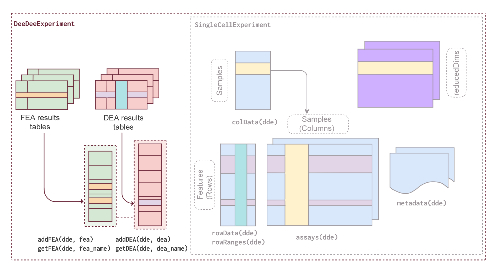

<style type="text/css">
.smaller {
  font-size: 10px
}
</style>

```{r setup, include = FALSE}
knitr::opts_chunk$set(
  collapse = TRUE,
  comment  = "#>",
  error    = FALSE,
  warning  = FALSE,
  eval     = TRUE,
  message  = FALSE
)
```

# Introduction {#introduction}

## Why do we need a new class?

Differential expression analysis (DEA) and functional enrichment analysis (FEA)
are core steps in transcriptomic workflows, helping researchers detect and
interpret biological differences between conditions. However, as the number of
conditions (defined by complex experimental designs) and analysis tools
increases, managing the outputs of these analyses across multiple contrasts
becomes increasingly overwhelming. This challenge is further amplified in
single-cell RNA-seq, where pseudo-bulk analyses generate numerous results tables
across cell types and contrasts, making it challenging to organize, explore, and
reproduce findings, even for experienced users.

To address these issues, we introduce the `r BiocStyle::Biocpkg("DeeDeeExperiment")`
class, an S4 object that extends the widely adopted `SingleCellExperiment` class
in Bioconductor.

`DeeDeeExperiment` provides a structured and consistent framework for integrating
DEA and FEA results alongside core expression data and metadata. By centralizing
these results in a single container, `DeeDeeExperiment` enables users to retrieve,
explore, and manage their analysis results more efficiently across multiple contrasts.

This vignette introduces the class structure, demonstrates how to create and work
with `DeeDeeExperiment` objects, and walks through a typical RNA-seq workflow
using the class.

## Anatomy of DeeDeeExperiment

The `DeeDeeExperiment` class inherits from the core Bioconductor `SingleCellExperiment`
object. This means it inherits all the slots, methods, and compatibility with
tools built for `SingleCellExperiment`, while introducing additional components
to streamline downstream analysis.

{width=100%}

Specifically, `DeeDeeExperiment` has two new slots:

- `dea` : a list that stores results from differential expression analysis (DEA),
along with relevant metadata. This includes:

  - The used False Discovery Rate (FDR) and log2 fold change (LFC) thresholds
  (if specified).
  - Meta info related to both the LFC and p-value.
  - The package used to generate the DE results (e.g. `r BiocStyle::Biocpkg("DEseq2")`,
  `r BiocStyle::Biocpkg("edgeR")` or `r BiocStyle::Biocpkg("limma")`...).
  - A pointer to the original DE result object, which is kept in the `metadata`
  of the `DeeDeeExperiment` object.

The main columns to use in DEA in addition to the feature identifier
(`log2FoldChange`, `pvalue`, and `padj`) are also stored in the `rowData` of the
`DeeDeeExperiment` object.

- `fea` : a list that stores results from functional enrichment analysis (FEA),
along with relevant metadata. This includes:

  -   The name of the associated DEA contrast.
  -   The FEA name.
  -   A `GeneTonicList`-compatible set of `shaken_results` (ready to be used in
  `r BiocStyle::Biocpkg("GeneTonic")`).
  -   The enrichment tool used to generate the results (e.g. `topGO`,
  `clusterProfiler...`).
  -   A copy of the original enrichment result object.

## Creating a `DeeDeeExperiment` object

In order to create a `DeeDeeExperiment` object, at least one of the following
inputs are required:

- `sce`: A `SingleCellExperiment` object, that will be used as a scaffold to
store the DE related information.
- `de_results`: A named list of DE results, in any of the formats supported by
the package (currently results from `DESeq2`, `edgeR`, `limma`, or `muscat`).
- `enrich_results`: A named list of FE results, as `data.frame` generated by one
of the following packages (currently `topGO`, `clusterProfiler`, `enrichR`,
`gProfiler`, `fgsea`, `gsea`, `DAVID`, and output of `GeneTonic` shakers)

```{r create_dde, eval = FALSE}
# do not run
dde <- DeeDeeExperiment(
  sce = sce, # sce is a SingleCellExperiment object
  # de_results is a named list of de results
  de_results = de_results,
  # enrich_res is a named list of enrichment results
  enrich_results = enrich_results
)
```

# Getting started {#gettingstarted}

To install this package, start R and enter:

```{r install, eval = FALSE}
if (!requireNamespace("BiocManager", quietly = TRUE)) {
  install.packages("BiocManager")
}

BiocManager::install("DeeDeeExperiment")
```

Once installed, the package can be loaded and attached to your current workspace
as follows:

```{r loadlib}
library("DeeDeeExperiment")
```

# `DeeDeeExperiment` on the `macrophage` dataset

In the remainder of this vignette, we will illustrate the main features of `r BiocStyle::Biocpkg("DeeDeeExperiment")` on a publicly available dataset from
Alasoo, et al. "Shared genetic effects on chromatin and gene expression indicate
a role for enhancer priming in immune response", published in Nature Genetics,
January 2018 
[@Alasoo2018] [doi:10.1038/s41588-018-0046-7](https://doi.org/10.1038/s41588-018-0046-7).

The data is made available via the `r BiocStyle::Biocpkg("macrophage")`
Bioconductor package, which contains the files output from the Salmon
quantification (version 0.12.0, with GENCODE v29 reference), as well as the
values summarized at the gene level, which we will use to exemplify.

In the `macrophage` experimental setting, the samples are available from 6
different donors, in 4 different conditions (naive, treated with Interferon
gamma, with SL1344, or with a combination of Interferon gamma and SL1344).

Let's start by loading all the necessary packages:

```{r loadlibraries}
library("DeeDeeExperiment")

library("macrophage")
library("DESeq2")
library("edgeR")
library("DEFormats")
```

We will demonstrate how `DeeDeeExperiment` fits into a regular bulk RNA-seq data
analysis workflow. For this we will start by processing the data and setting up
the design for the Differential Expression Analysis (DEA).

```{r load_data}
# load data
data(gse, package = "macrophage")
```

If you already have your differential expression results and want to skip the
DEA workflow examples, you can jump directly to the section 
[4 Creating DeeDeeExperiment the DeeDee way](#creating_deedeeexperiment_the_deedee_way) 
- otherwise, you can follow along in the subsequent sections where we will
showcase how the typical objects from each DE framework will seamlessly fit into
a `DeeDeeExperiment` object.

The remainder of this vignette assumes some knowledge of Differential Expression
Analysis workflows. If you want some excellent introductions to this topic, you
can refer to [@Love2016] and [@Law2018] - Otherwise, you can check [@Ludt2022]
for a comprehensive overview of these workflows, as well as the usage of tools
such as `GeneTonic` or `pcaExproler` for interactive exploration.

## DEA: DESeq2 framework

Below we will demonstrate an example on how to generate DE results with `DESeq2`

```{r dds_setup}
# set up design
dds_macrophage <- DESeqDataSet(gse, design = ~ line + condition)
rownames(dds_macrophage) <- substr(rownames(dds_macrophage), 1, 15)
keep <- rowSums(counts(dds_macrophage) >= 10) >= 6

dds_macrophage <- dds_macrophage[keep, ]
```

For the sake of demonstration, we will further subset the dataset for faster
processing

```{r dds_subset}
# set seed for reproducibility
set.seed(42)
# sample randomly for 1k genes to speed up the processing
selected_genes <- sample(rownames(dds_macrophage), 1000)

dds_macrophage <- dds_macrophage[selected_genes, ]
```

We then run the main `DESeq()` function and check the `resultsNames` being
generated

```{r dds_macrophage}
dds_macrophage
# run DESeq
dds_macrophage <- DESeq(dds_macrophage)
# contrasts
resultsNames(dds_macrophage)
```

Let's extract the DE results for each contrast. We will only use two contrasts

```{r extract_de_results}
FDR <- 0.05
# IFNg_vs_naive
IFNg_vs_naive <- results(dds_macrophage,
                         name = "condition_IFNg_vs_naive",
                         lfcThreshold = 1,
                         alpha = FDR
)
IFNg_vs_naive <- lfcShrink(dds_macrophage,
                           coef = "condition_IFNg_vs_naive",
                           res = IFNg_vs_naive,
                           type = "apeglm"
)

# Salm_vs_naive
Salm_vs_naive <- results(dds_macrophage,
                         name = "condition_SL1344_vs_naive",
                         lfcThreshold = 1,
                         alpha = FDR
)
Salm_vs_naive <- lfcShrink(dds_macrophage,
                           coef = "condition_SL1344_vs_naive",
                           res = Salm_vs_naive,
                           type = "apeglm"
)

head(IFNg_vs_naive)
head(Salm_vs_naive)
```

We now have two `DESeqResults` objects: `IFNg_vs_naive` and `Salm_vs_naive`,
ready to be integrated into a `DeeDeeExperiment` object.

## DEA: limma framework

Not working with `DESeq2`? No problem. `DeeDeeExperiment` is method-agnostic and
easily integrates results from other frameworks like `limma`. In this section,
we will walk through a typical `limma` workflow to generate DE results.

For demonstration purposes, we convert the filtered `dds_macrophage` as input
for `limma`, using the  `as.DGEList()` function from the `DEFormats` package.

```{r dds_to_dge}
# create DGE list
dge <- DEFormats::as.DGEList(dds_macrophage)
```

We then normalize and voom-transform the expression values, before running the
`lmFit()` function:

```{r limmarun}
# normalize the counts
dge <- calcNormFactors(dge)

# create design for DE
design <- model.matrix(~ line + group, data = dge$samples)
# transform counts into logCPM
v <- voom(dge, design)

# fitting linear models using weighted least squares for each gene
fit <- lmFit(v, design)
```

We define here as usual the contrast matrix:

```{r limma_contrasts}
# available comparisons
colnames(design)
# setup comparisons
contrast_matrix <- makeContrasts(
  IFNg_vs_Naive = groupIFNg,
  Salm_vs_Naive = groupSL1344,
  levels = design
)
```

We then extract the results by applying the `contrasts.fit` function, followed
by the empirical Bayes moderation as it follows:

```{r ebayes}
# apply contrast
fit2 <- contrasts.fit(fit, contrast_matrix)

# empirical Bayes moderation of standard errors
fit2 <- eBayes(fit2)
de_limma <- fit2 # MArrayLM object
```

We show here the top 10 DE genes, as detected in the contrast `IFNg_vs_Naive`

```{r topTable}
# show top 10 genes, first columns
topTable(de_limma, coef = "IFNg_vs_Naive", number = 10)[, 1:7] 
```

We now have a `MArrayLM` object: `de_limma`, ready to be integrated into a
`DeeDeeExperiment` object.

## DEA: edgeR framework

Below we will walk you through a typical `edgeR` pipeline to produce DE results
ready for integration in `DeeDeeExperiment`.

We reuse the normalized `DGEList` and design matrix from the previous `limma`
workflow (again, created via `DEFormats::as.DGEList()`):

```{r glmfit}
dge <- DEFormats::as.DGEList(dds_macrophage)

# estimate dispersion
dge <- estimateDisp(dge, design)
# perform likelihood ratio test
fit <- glmFit(dge, design)
```

Here as well, we define the contrasts of interest:

```{r edgeR_contrasts}
# available comparisons
colnames(design)
# setup comparisons
contrast_matrix <- makeContrasts(
  IFNg_vs_Naive = groupIFNg,
  Salm_vs_Naive = groupSL1344,
  levels = design
)
```

... and. we create the `DGELRT` objects to store the DE results as follows:

```{r dge_lrt}
# DGELRT objects
dge_lrt_IFNg_vs_naive <- glmLRT(fit,
                                contrast = contrast_matrix[, "IFNg_vs_Naive"])
dge_lrt_Salm_vs_naive <- glmLRT(fit,
                                contrast = contrast_matrix[, "Salm_vs_Naive"])
```

The top 10 DE genes computed within the edgeR framework can be shown as in this
chunk:

```{r topTag1}
# show top 10 genes, first few columns
topTags(dge_lrt_IFNg_vs_naive, n = 10)[, 1:7] 
```

For the sake of demonstrating that `DeeDeeExperiment` can handle the different
objects from the `edgeR` framework, we also compute some results with the
`exactTest()` approach.

```{r dge_exact}
# perform exact test
# exact test doesn't handle multi factor models, so we have to subset

# IFNg vs naive
keep_samples <- dge$samples$group %in% c("naive", "IFNg")
dge_sub <- dge[, keep_samples]
# droplevel
group <- droplevels(dge_sub$samples$group)
dge_sub$samples$group <- group

# recalculate normalization and dispersion
dge_sub <- calcNormFactors(dge_sub)
dge_sub <- estimateDisp(dge_sub, design = model.matrix(~group))
# exact test
# DGEExact object
dge_exact_IFNg_vs_naive <- exactTest(dge_sub, pair = c("naive", "IFNg")) 


# SL1344 vs naive
keep_samples <- dge$samples$group %in% c("naive", "SL1344")
dge_sub <- dge[, keep_samples]
# droplevel
group <- droplevels(dge_sub$samples$group)
dge_sub$samples$group <- group

# recalculate normalization and dispersion
dge_sub <- calcNormFactors(dge_sub)
dge_sub <- estimateDisp(dge_sub, design = model.matrix(~group))
# exact test
dge_exact_Salm_vs_naive <- exactTest(dge_sub, pair = c("naive", "SL1344"))
```

Again, the top 10 DE genes in the `dge_exact_Salm_vs_naive` object can be shown
with

```{r topTag_2}
topTags(dge_exact_Salm_vs_naive, n = 10)[, 1:7]
```

We now have two `DGELRT` & two `DGEExact` objects: `dge_lrt_IFNg_vs_naive`,
`dge_lrt_Salm_vs_naive` & `dge_exact_IFNg_vs_naive`, `dge_exact_Salm_vs_naive`
respectively, ready to be integrated into a `DeeDeeExperiment` object.

For demonstration purposes, we will use precomputed FEA results generated with
`run_topGO()` (a practical wrapper provided by the `mosdef` package), and with
the `gost()` function from `gprofiler2` package.

```{r load_FEAs}
# load Functional Enrichment Analysis results examples
data("topGO_results_list", package = "DeeDeeExperiment")
data("gost_res", package = "DeeDeeExperiment")
data("clusterPro_res", package = "DeeDeeExperiment")
```

The enrichment results can be displayed in a summary way with these commands:

```{r topGO}
# ifng vs naive
head(topGO_results_list$ifng_vs_naive)
```

```{r gost}
# salmonella vs naive
head(gost_res$result)
```

```{r clusterPro}
# ifng vs naive
head(clusterPro_res$ifng_vs_naive)
```

To check which formats of Functional Enrichment Analysis (FEA) results are
supported natively within `DeeDeeExperiment`, simply run the following command:

```{r fea_formats}
DeeDeeExperiment::supported_fea_formats()
```

By now, we collected DEA results from three different frameworks and generated
multiple FEA results. Each result has its own structure, columns, metadata, ...

Managing and exploring this growing stack of outputs can quickly become
overwhelming. So let’s now see how `DeeDeeExperiment` brings all these pieces
together.

# Creating `DeeDeeExperiment` the DeeDee way {#creating_deedeeexperiment_the_deedee_way}

In the following example we construct the dde object using a `dds` object and
**named list** of DE results

```{r construct_dde}
# initialize DeeDeeExperiment with dds object and DESeq results (as a named list)
dde <- DeeDeeExperiment(
  sce = dds_macrophage,
  de_results = list(
    IFNg_vs_naive = IFNg_vs_naive,
    Salm_vs_naive = Salm_vs_naive
  )
)

dde
```

You can see from the summary overview that the information on the two `dea` has
been added to the original object.

## Adding results to a `dde` object

### Adding DEA results

Additional DE results can be added using the `addDEA()` method. These results
are stored in both the `dea` slot and in the `rowData`.

We can also add results as individual element of class `DESeqResults`,
`MArrayLM`, `DGEExact` or `DGELRT`.

```{r addDEA}
# add a named list of results from edgeR
dde <- addDEA(dde, dea = list(
  dge_exact_IFNg_vs_naive = dge_exact_IFNg_vs_naive,
  dge_lrt_IFNg_vs_naive = dge_lrt_IFNg_vs_naive
))

# add results from limma as a MArrayLM object
dde <- addDEA(dde, dea = de_limma)

dde
# inspect the columns of the rowData
names(rowData(dde))
```

The `dde` object now contains 5 DEAs in its `dea` slot. The `rowData` also
includes a record of the `log2FoldChange`, `pvalue`, and `padj` values for each
contrast.

It is possible to overwrite the results, when the argument `force` is set to
`TRUE`

```{r addDEA_force}
dde <- addDEA(dde, dea = list(same_contrast = dge_lrt_Salm_vs_naive))

# overwrite results with the same name
# e.g. if the content of the same object has changed
dde <- addDEA(dde,
               dea = list(same_contrast = dge_exact_Salm_vs_naive),
               force = TRUE)

dde
```

### Adding multi-contrast DEA results

In `limma`, an `MArrayLM` object may contain **multiple contrasts**, each
represented as a column in the `coefficients` matrix. When such an object is
supplied to `DeeDeeExperiment`, only one contrast (by default, coefficient 2)
can be extracted at a time. The constructor therefore issues a warning when
it detects more than one coefficient:

```{r dde_with_limma_multi}
dde_limma <- DeeDeeExperiment(sce = dds_macrophage,
                              de_results = de_limma)

dde_limma
```

To work with **all** contrasts contained in a multi-contrast `MArrayLM` object,
the results must first be expanded into a list of per-contrast tables. This is
achieved using the `limma_list_for_dde()` helper function:

```{r convert_limma_to_list}
dde_limma_list <- limma_list_for_dde(fit = de_limma,
                                     number = nrow(de_limma),
                                     sort.by = "none")

names(dde_limma_list)
```

The output is a named list, where each element corresponds to one contrast in
the original `MArrayLM` object.
Now we can insert all contrast directly into a `DeeDeeExperiment` object at once:

```{r add_multi_limma}
dde_limma <- addDEA(dde_limma,
                    dea = dde_limma_list)

dde_limma
```

### Adding FEA results

FEA results can be added to a `dde` object using the `addFEA()` method. These
results are stored in the `fea` slot.

If the `fea_tool` argument was not specified, the internal function used to
generate the standardized format of FEA result is automatically detected - this
should work in most cases, but it can be beneficial to explicitly specify the
`fea_tool` used, also for simple bookkeeping reasons.

```{r addFEA}
# add FEA results as a named list
dde <- addFEA(dde,
               fea = list(IFNg_vs_naive = topGO_results_list$ifng_vs_naive))

# add FEA results as a single object
dde <- addFEA(dde, fea = gost_res$result)

# add FEA results and specify the FEA tool
dde <- addFEA(dde, fea = clusterPro_res, fea_tool = "clusterProfiler")

dde
```

## Linking DE and FE Analysis in a `dde` object

Once DE and FE results have been added, FEAs can be linked to specific DE
contrasts using the `linkDEAandFEA()` method. This maintains a clear
association between the analyses and helps document it within the `dde` object.

```{r link_fea}
dde <- linkDEAandFEA(dde,
                        dea_name = "Salm_vs_naive",
                        fea_name = c("salmonella_vs_naive", "gost_res$result")
)
```

This is then directly visible in the object summary, provided with the dedicated
`summary()` method:

```{r summary-linked}
summary(dde)
```

## Adding contextual information

It is possible to add context to specific DEA results that are stored in a `dde`
object using the `addScenarioInfo()` method. This information can help
document the experimental setup, clarify comparisons, or maybe provided as
additional element to a large language model that can benefit of the extra bits
to assist in the interpretation.

```{r addScenarioInfo}
dde <- addScenarioInfo(dde,
                         dea_name = "IFNg_vs_naive",
                         info = "This results contains the output of a Differential Expression Analysis performed on data from the `macrophage` package, more precisely contrasting the counts from naive macrophage to those associated with IFNg."
)
```

## Summary of a `dde` object

All results stored in a `dde` object can be easily inspected with the `summary()`
method

```{r summary_mini}
# minimal summary
summary(dde)
```

It is possible to customize the output of `summary()` using optional arguments.
For example, the `FDR` threshold can be adjusted to display the number of up-
and downregulated genes for each comparison.

```{r summary_fdr}
# specify FDR threshold for subsetting DE genes based on adjusted p-values
summary(dde, FDR = 0.01)
```

It is also possible to include any scenario information associated with each
DEA by setting `show_scenario_info = TRUE`

```{r summary_show_scenario}
# show contextual information, if available
summary(dde, show_scenario_info = TRUE)
```

## Renaming results in a `dde` object

Specific results can be renamed after being added using the `renameDEA()` and
`renameFEA()` methods. The corresponding column names in the `rowData` will be
updated accordingly.

```{r rename}
# rename dea, one element
dde <- renameDEA(dde,
                  old_name = "de_limma",
                  new_name = "ifng_vs_naive_&_salm_vs_naive"
)

# multiple entries at once
dde <- renameDEA(dde,
                  old_name = c("dge_exact_IFNg_vs_naive", "dge_lrt_IFNg_vs_naive"),
                  new_name = c("exact_IFNg_vs_naive", "lrt_IFNg_vs_naive")
)

# rename fea
dde <- renameFEA(dde,
                  old_name = "gost_res$result",
                  new_name = "salm_vs_naive"
)
```

## Removing results in a `dde` object

The method `removeDEA()` and `removeFEA()` can be used to delete results from
a `dde` object.

```{r remove}
# removing dea
dde <- removeDEA(dde, c(
  "ifng_vs_naive_&_salm_vs_naive",
  "exact_IFNg_vs_naive",
  "dge_Salm_vs_naive"
))

# removing fea
dde <- removeFEA(dde, c("salmonella_vs_naive"))

dde
```

## Accessing results stored in a `dde` object

Several accessor methods are available to retrieve DEA and FEA results stored
within a `dde` object.

`getDEANames()` and `getFEANames()` are the methods to quickly retrieve the names
of available DEAs and FEAs

```{r names}
# get DEA names
getDEANames(dde)

# get FEA names
getFEANames(dde)
```

It is possible to directly access specific DEA results either in their original
format or in minimal format. Use `format = "original"` to retrieve results in
the same class as originally provided (e.g., `DESeqResults`, `MArrayLM`...).

```{r get_dea_res}
# access the 1st DEA if dea_name is not specified (default: minimal format)
getDEA(dde) |> head()

# access the 1st DEA, in original format
getDEA(dde, format = "original") |> head()

# access specific DEA by name, in original format
getDEA(dde,
    dea_name = "lrt_IFNg_vs_naive",
    format = "original"
) |> head()

# access specific DEA by name (default: minimal format)
getDEA(dde, dea_name = "lrt_IFNg_vs_naive") |> head()
```

`getDEAList()` retrieves all available DEAs stored in a dde object as a list.

```{r getDEAList}
# get dea results as a list, (default: minimal format)
lapply(getDEAList(dde), head)
```

The next command can be quite verbose in its output, but it gives full access to
the original objects provided when creating and updating the `dde` container.

```{r getDEAList-original, eval = FALSE}
# get dea results as a list, in original format
lapply(getDEAList(dde, format = "original"), head)
```

`getDEAInfo()` returns the whole content of the `dea` slot, including the DEA metadata - the following chunk is left unevaluated for clarity as its output
can be very verbose.

```{r getDEAInfo, eval = FALSE}
# extra info
getDEAInfo(dde)
```

It is easy, still, to retrieve some specific set of information, such as the
`package` used for a specific `dea_name`:

```{r dea_info_specific}
# retrieve specific information like the package name used for specific dea
dea_name <- "Salm_vs_naive"
getDEAInfo(dde)[[dea_name]][["package"]]
```

In this case, both contrasts point to the same stored object (`key`), but with different `coef` values. This avoids duplicating the original `MArrayLM` fit while still allowing each contrast to be resolved back to its corresponding results.

`getFEA()` directly accesses specific FEA results either in their original format
or in minimal format

```{r get_fea_res}
# access the 1st FEA, (default: minimal format)
getFEA(dde) |> head()

# access the 1st FEA, in original format
getFEA(dde, format = "original") |> head()

# access specific FEA by name
getFEA(dde, fea_name = "ifng_vs_naive") |> head()

# access specific FEA by name, in original format
getFEA(dde, fea_name = "ifng_vs_naive", format = "original") |> head()
```

Similarly to `getDEAList()`, `getFEAList()` returns all FEAs stored in a
`dde` object. Optionally, if `dea_name` is set, it returns all FEAs linked to a
specific DEA. This is illustrated in the following chunk

```{r getFEAList}
# get fea results as a list (default: minimal format)
lapply(getFEAList(dde), head)


# get all FEAs for this de_name, in original format
lapply(getFEAList(dde, dea_name = "IFNg_vs_naive", format = "original"), head)
```

`getFEAInfo()` returns the whole content of the `fea` slot, including the FEA tables and their associated metadata. Again, the following chunk is left
unevaluated for clarity as its output can be very verbose:

```{r getFEAInfo, eval = FALSE}
# extra info
getFEAInfo(dde)
```

Yet, specific set of information, such as the `fe_tool` used for a specific
`fea_name` (here, "ifng_vs_naive") can be easily retrieved with:

```{r fea_info_specific}
# the tool used to perform the FEA
getFEAInfo(dde)[["ifng_vs_naive"]][["fe_tool"]]
```

# Downstream operations with `DeeDeeExperiment` objects

Since `DeeDeeExperiment` inherits from the `SingleCellExperiment` class, it can
be seamlessly used with other Bioconductor tools such as `iSEE` or `GeneTonic`,
or many more.

With the `dde` object now containing all key elements of your analysis, from the
counts to enrichment results, metadata, and scenario details, you can save it
and plug it into these tools for interactive exploration and visualization.

```{r save, eval = FALSE}
saveRDS(dde, "dde_macrophage.RDS")
```

To explore the `dde` object within `iSEE`, simply run these lines of code:

```{r runiSEE, eval = FALSE}
library("iSEE")
iSEE::iSEE(dde)
```

Similarly, to see more on `dde` within `GeneTonic`, you can run the following
chunk:

```{r runGeneTonic, eval = FALSE}
library("GeneTonic")
my_dde <- dde

res_de <- getDEA(my_dde, dea_name = "IFNg_vs_naive", format = "original")
res_enrich <- getFEA(my_dde, fea_name = "ifng_vs_naive")
annotation_object <- mosdef::get_annotation_orgdb(dds_macrophage,
                                                  "org.Hs.eg.db",
                                                  "ENSEMBL")

GeneTonic::GeneTonic(
  dds = dds_macrophage,
  res_de = res_de,
  res_enrich = res_enrich,
  annotation_obj = annotation_object,
  project_id = "GeneTonic_with_DeeDee"
)
```

Of course, these packages need to be installed as usual on the same machine via
`BiocManager::install()`.

# FAQs

*Do I need to process/filter my DE results before adding them to a `dde` object?* 

&rarr; `DeeDeeExperiment` is just a container, it does not alter your results.
Any filtering or DEG selection should be done beforehand, giving you full
control over how your analysis is conducted.

*What happens if I forget to name my DE or FE result when adding it?*

&rarr; If no name is provided, `DeeDeeExperiment` will attempt to assign a
default one, which is the variable name in the current environment. However,
it's strongly recommended to name each result clearly.

*I am using a different enrichment analysis tool, and this is currently not supported by DeeDeeExperiment, what can I do?*

&rarr; The quick-and-easy option would be to rename the output of the tabular
format from this tool into the format expected by `DeeDeeExperiment` (which is
the same adopted by `GeneTonic`). If you think a conversion function would be
useful to yourself and many other users, feel free to submit a pull request
within the `DeeDeeExperiment` Github repository (https://github.com/imbeimainz/DeeDeeExperiment/pulls)!

# Session info {.unnumbered .smaller}

```{r sessioinfo}
sessionInfo()
```

# References {.unnumbered}
